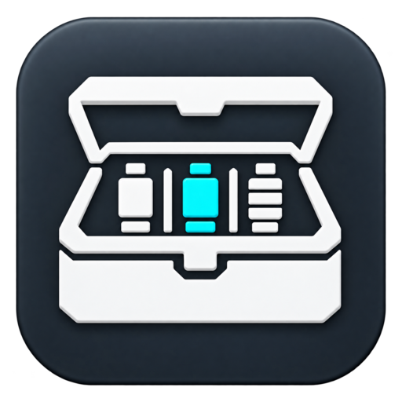

# arsenal

<p align="center">
  
</p>

[](https://github.com/Okymi-X/arsenal/actions/workflows/ci.yml)
[](https://github.com/Okymi-X/arsenal/releases)
[](LICENSE)

A package and environment manager specialized for offensive-security tooling.
It is a domain-aware alternative to `pipx`/`uv`.

The point of arsenal is not the packaging mechanics. It is the curated registry:
a hand-maintained, tested mapping from tool name to known-good versions
(NetExec/nxc, Impacket, Certipy, and more), pinned and annotated so you never
have to open a repo mid-engagement to find out which version actually works.

arsenal ships as a single statically linked binary. Installers orchestrate the
relevant package manager already present on the host (`python`/`pip`, `go`, or
`cargo`); Arsenal does not reimplement or bundle those language runtimes.

## Features

- Curated TOML registry of tested versions, pinned by commit, with the required
  Python version and operational notes.
- Per tool/version installation roots using Python virtualenvs, isolated Go
  builds, or isolated Cargo builds, with a container backend planned behind the
  same interface.
- Engagement profiles ("ops"): pin a set of tool versions, produce a lockfile,
  and make an environment reproducible and shareable across a team.
- Private shims so multiple versions coexist and the active one is switchable
  without replacing same-named host tools.
- A `fetch` command for precompiled upload-binaries (SharpCollection, winPEAS,
  linPEAS, pspy): pulls the latest version straight into a directory you pick,
  with no env and no shim.
- A `doctor` command that reports and repairs broken installs.
- Shell completion for bash, zsh, and fish (`arsenal completion <shell>`).
- Works offline out of the box: the curated registry is embedded in the binary.

## Install

Install the latest release with Go 1.26 or newer:

```
go install github.com/Okymi-X/arsenal/cmd/arsenal@latest
```

The binary is written to `GOBIN`, or to `GOPATH/bin` when `GOBIN` is unset.
Ensure that directory is on your `PATH`.

Alternatively, build and install from a source checkout:

```
make build
sudo make install
```

Arsenal keeps tool shims off the host `PATH` by default. Run managed tools with
`arsenal run` so an existing pipx, system, or user installation keeps its
normal command name.

## Quick start

```
arsenal search ad              # browse the registry by keyword
arsenal info nxc               # see tested versions of NetExec
arsenal versions nxc --github # inspect upstream GitHub tags
arsenal install nxc            # install the newest tested version
arsenal install impacket@0.12.0
arsenal outdated               # show safe tested upgrades
arsenal upgrade nxc            # keep the old version for rollback
arsenal list                   # show installed tools; [*] marks active
arsenal run nxc -- smb 10.0.0.1
arsenal switch nxc 1.3.0       # repoint shims to another installed version
arsenal remove nxc

arsenal fetch linpeas --dest ./www          # stage an upload-binary, latest version
arsenal fetch sharpcollection Rubeus --dest ./www
```

Output is quiet by default. Add `-v`/`--verbose` for detail. There is no color
unless stdout is a TTY, and no emoji anywhere.

## The registry concept

Each tool entry records its repo, category, install method, required Python
version, exposed binaries, and a list of versions. Each version carries a tag, a
pinned commit, a `tested` flag, package-manager targets, a date, and notes. The
newest tested version is selected by default; you can always pin an explicit
one with `tool@version`.

Refresh the registry from upstream at any time:

```
arsenal sync
arsenal sync --list-refs
arsenal sync --ref v1.0.0
```

The repository keeps a small ordered manifest at `registry/registry.toml` and
the actual entries in topical files under `registry/segments/`, avoiding a
second generated monolithic catalog.

The full schema is documented in [docs/registry-format.md](docs/registry-format.md).

## The op workflow

An "op" is an engagement profile: a named set of pinned tool versions that you
can reproduce and share.

```
arsenal op create redteam-q3 "Q3 internal"
arsenal op pin redteam-q3 nxc            # pins the newest tested version
arsenal op pin redteam-q3 impacket@0.12.0
arsenal op export redteam-q3             # writes a TOML lockfile
arsenal op use redteam-q3                # installs everything in the lockfile
```

Hand the lockfile to a teammate and they reproduce the exact set:

```
arsenal op import redteam-q3.lock.toml
```

## Documentation

- [docs/PRD.md](docs/PRD.md) - product scope and acceptance criteria
- [docs/ARCHITECTURE.md](docs/ARCHITECTURE.md) - package layout, interfaces,
  and trust boundaries
- [docs/RULES.md](docs/RULES.md) - mandatory engineering and security rules
- [docs/DESIGN.md](docs/DESIGN.md) - CLI and implementation design decisions
- [docs/TASKS.md](docs/TASKS.md) - verified repository-level work plan
- [docs/MEMORY.md](docs/MEMORY.md) - durable project facts for maintainers and
  agents
- [docs/registry-format.md](docs/registry-format.md) - the registry schema
- [docs/usage.md](docs/usage.md) - full command reference

## Status

The venv backend and the pip, git+pip, Go, and Cargo install methods are
implemented alongside the registry, shim system, op lockfiles, and core
commands. The container backend, offline bundle, and prebuilt-binary install
method remain explicit tracked stubs.

## License

MIT. See [LICENSE](LICENSE).
